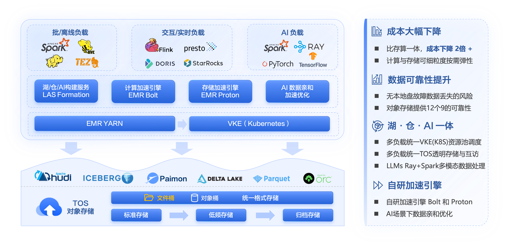

## 火山EMR简介

火山EMR 提供火山增强的 Hadoop、Spark、Flink、Hive、Presto、Hudi、Iceberg 、Doris/StarRocks、Ray、PyTorch 等大数据与AI 生态组件，100%开源兼容，支持构建 数据湖、湖仓一体、Data for AI 等平台架构。
提供on ECS形态、ON VKE形态，VKE是火山引擎容器服务。EMR中自研湖加速引擎 Proton，存算分离场景下，性能超过存算一体，且成本降低。同时自研向量化执行引擎 Bolt，Spark/Presto计算引擎性能优于开源。
EMR on VKE形态下，提供离线负载与在线业务混部，提高资源利用率；提供Spark、Ray、PyTorch等AI框架和数据预处理工程实践优化等功能。

## Getting Started
在该工程源码中，提供on ECS形态和on VKE形态下引擎使用示例，便于用于更好的上手。
- **emr-on-ecs**  提供存算分离等场景下的示例代码，参考emr-on-ecs目录下README.md文档进行操作和使用。也可以参考官网[emr-on-ecs](https://www.volcengine.com/docs/6491/1216706) 。
- **emr-on-vke** 提供一些AI和数据分析场景下的示例工程，参考emr-on-vke目录下README.md文档进行操作和使用。也可以参考官网[emr-on-vke](https://www.volcengine.com/docs/6491/1218706) 。

## 🤝 支持与反馈
本工程由火山引擎EMR服务团队维护，如果您有反馈、功能想法或希望报告错误，请使用此 GitHub 的[Issues](https://github.com/volcengine/emr-tutorial/issues)，我们将尽最大努力提供支持。