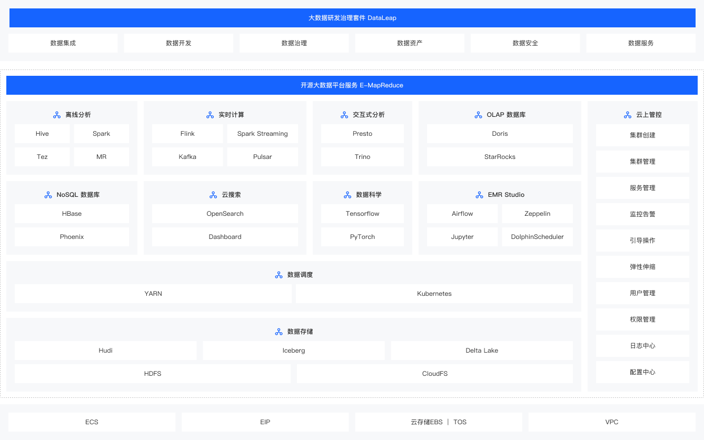

## EMR ON ECS 简介
ECS形态下，即EMR集群基于火山引擎云服务器进行部署，提供数据湖、数据分析等应用场景，详细信息参考官网🔗[什么是EMR](https://www.volcengine.com/docs/6491/72145)

- 基础设施： 基于火山引擎云服务器（ECS）、公网IP（EIP）、弹性块存储（EBS）、对象存储（TOS）、私有网络（VPC）为EMR提供弹性扩展、高可靠、高性能、安全隔离的部署环境。

- 数据存储： HDFS分布式文件系统支持海量结构化和非结构化数据存储，支持多种高效格式满足不同分析引擎要求，同时对接TOS对象存储，实现高可用低成本数据存储。支持Hudi、Iceberg、Delta Lake等多种数据湖存储格式，助力企业构建数据湖解决方案。

- 资源调度： 基于hadoop资源管理组件Yarn和Kubernetes，为上层应用提供统一的资源管理和调度。

- 开源引擎： 提供丰富的主流开源生态组件，100%兼容开源，并基于字节内部实践持续深度优化，覆盖离线计算、实时计算、交互式分析、OLAP数据库、NoSQL数据库、云搜索、数据科学、数据开发、权限管控等领域，满足各类大数据应用场景需求。

- 管控运维： 支持集群创建发放、一键部署、统一运维管理能力，支持集群弹性扩容、弹性伸缩、以及对各组件的监控、告警、配置、日志查看等一站式运维能力。

## 代码结构介绍
在本代码工程中，提供一些EMR常用的一些场景和用例。不同的场景放在不同的moudle中，并在每个moudle的README.md文档中提供该场景的使用方法。现在介绍下不同的moudle适用的场景。
* **Proton-examples** 存算分离场景下，使用EMR自研的加速引擎proton可以提高读写TOS的性能。该样例代码中提供了Flink组件中使用proton的操作样例。关于proton的介绍可参考🔗[Proton概述](https://www.volcengine.com/docs/6491/149821)
* **iceberg-examples** 对Iceberg表进行读写的样例代码
* **flink-examples** 关于Flink引擎样例代码