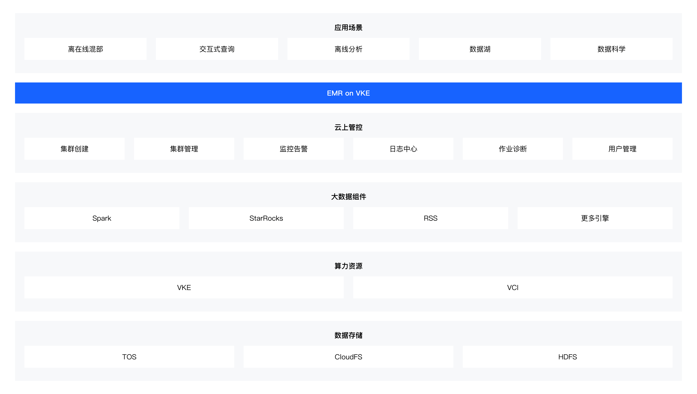

# [EMR on VKE](https://www.volcengine.com/docs/6491/1221487/)
火山引擎E-MapReduce（简称EMR） on VKE 基于容器化服务、开源大数据引擎，提供可快速部署、灵活伸缩、高效安全的大数据服务部署平台。通过EMR on VKE，您能减少对底层集群资源的运维投入，以便于更加专注大数据任务本身。

## 🏗️ 架构
下图展示了 EMR on VKE 支持的各种开源数据工具、Kubernetes 运算符和框架。



## 🚀 基于EMR on VKE服务部署AI/ML平台

在 **emr-on-vke** 工程中，提供一些AI和数据分析场景下的示例工程，方便用于更容易理解和使用EMR集群。通过深入研究各种实际示例，展示在 EMR on vke形态下上运行 AI/ML 工作负载的潜力和灵活性，包括 [Apache Spark](https://spark.apache.org/) ， [PyTorch](https://pytorch.org/) ， [Tensorflow](https://www.tensorflow.org/) ， [XGBoost](https://xgboost.readthedocs.io/en/stable/) 等，探索 [Ray](https://www.ray.io/) ， [NVIDIA GPUs](https://aws.amazon.com/nvidia/) 等尖端机器学习平台.

该工程中分为以下几个领域：

🎯  ai-ml

在 Kubernetes 上运行 AI/ML 平台可以极大地简化和自动化这些复杂应用程序的部署、扩展和管理。目前出现了许多流行的工具和技术来支持此用例，包括TensorFlow、PyTorch、Ray等。
- **Ray** 
  
  EMR on VKE形态下，通过KubeRay Operator在 Kubernetes 上部署 Ray 集群。KubeRay 引入了三种 Kubernetes 自定义资源定义（CRDs）：RayCluster、RayJob 和 RayService，用于帮助用户根据不同的使用案例高效地管理 Ray 集群。

  

🎯  analytics

在 Kubernetes 上运行数据分析工具可以为希望从大型复杂数据集中提取见解的组织提供许多好处。
- **Spark**  

  EMR on VKE形态下，Spark部署是采用Spark Operator方式。Spark Operator 简化了在 Kubernetes 上 Apache Spark 的部署和管理。通过使用 Spark Operator，组织可以利用自动扩展、滚动更新和自我修复功能等功能来确保数据分析管道的高可用性和可靠性。

## 🏃 使用介绍
在该工程中提供了一些示例，便于用户更好理解和使用EMR on VKE产品。

### 📚 ai-ml介绍

  - [Ray](https://www.volcengine.com/docs/6491/1221493) 本工程中提供RayCluster和RayJob的一些示例。

    -  **RayCluster示例**   以python文件提供Ray中data、tune等模块使用样例，可以通过`ray job submit`方式 或者 `python ray-examples/raycluster/job_submitter.py`方式提交。

    -  **RayJob样例** 以yaml文件方式运行RayJob，使用Kubernetes命令提交`kubectl yaml文件`。

#### 1. RayJob示例

在`emr-on-vke/ai-ml/ray-examples/rayjob`目录提供适配git、pvc等场景下RayJob使用的yaml文件。
进入`emr-on-vke/ai-ml/ray-examples/rayjob`目录下进行下面的操作。也可以参考[提交RayJob使用指导](https://www.volcengine.com/docs/6491/1264008) 提交作业。

```bash
# 步骤一  使用Kubectl命令执行yaml文件
kubectl apply -f <RayJob配置文件的名称> -n <KubeRay所在的命名空间>

# 步骤二  验证RayJob是否运行：使用以下命令检查RayJob的状态
kubectl describe rayjob <RayJob名称>  -n <KubeRay所在的命名空间>

# 步骤三  查看RayJob的日志信息
kubectl logs <RayJob生成的Pod名称> -n <KubeRay所在的命名空间>

# 步骤四 RayJob作业结束后删除Pod
kubectl delete rayjob <RayJob名称>-n <KubeRay所在的命名空间>
```


#### 2. RayCluster示例使用介绍

在`emr-on-vke/ai-ml/ray-examples/raycluster`目录提供有：配置文件config.py、job提交脚本job_submitter.py、一些作业示例，data模块的示例是以data开头的python文件，tune模块的示例是以tune开头的python文件等。
可以参考按照[KubeRay RayCluster使用指导](https://www.volcengine.com/docs/6491/1264045) 提交作业。也可以登录到head节点控制台，按照下面方式提交：

```bash
# 步骤一： 配置RayCluster的地址
# 在`config.py`文件中配置RayCluster地址

# 步骤二：提交作业
# 采用`ray job submit`方式提交,示例
ray job submit -- python data_quick_start.py

# 或采用Ray提供的`JobSubmissionClient`方式提交
# python job_submitter.py data_quick_start.py

# 步骤三：查看作业状态。提交Ray job后，会返回Job ID，这时可以通过下面shell命令查看作业状态
ray job status <jobID>
```


### 📚 analytics介绍

  - [Spark](https://www.volcengine.com/docs/6491/1221491) 提供以yaml文件方式和Python代码工程方式运行Spark作业。
