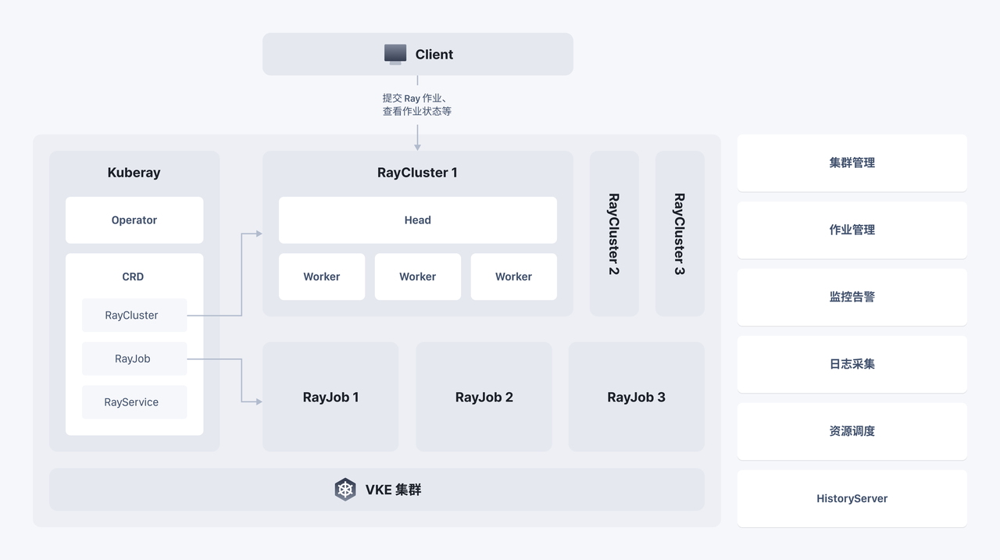

# [Ray On VKE](https://www.volcengine.com/docs/6491/1264004)
EMR on VKE产品中提供Ray在火山容器服务（VKE）下的部署方式。使用 KubeRay Operator在VKE部署Ray。该 Operator 提供了一种 Kubernetes 原生的方式来管理 Ray 集



KubeRay 引入了三种 Kubernetes 自定义资源定义（CRDs）：RayCluster、RayJob 和 RayService:
* RayCluster：KubeRay 完全管理 RayCluster 的生命周期，包括集群的创建/删除、自动伸缩和确保容错性。

* RayJob：使用 RayJob，KubeRay 在集群准备就绪时自动创建一个 RayCluster 并提交作业。还可以配置 RayJob 在作业完成后自动删除 RayCluster。

* RayService：用于管理 RayCluster和 Ray Serve 应用程序。RayService 为 RayCluster 提供零停机升级和高可用性。

本章节介绍RayCluster和RayJob的示例具体的使用指导。

## 🔑  RayJob示例

进入`emr-on-vke/ai-ml/ray-examples/rayjob`目录下进行下面的操作。可以参考[提交RayJob使用指导](https://www.volcengine.com/docs/6491/1264008) 提交作业。
* rayjob.sample.yaml  供了RayJob的简单示例，演示在Ray在创建和管理分布式对象，以及异步执行远程任务。
* rayjob.git.yaml 提供从Git拉取业务源码，在RayJob中运行的示例。
* rayjob.ingress.yaml 通过在RayJob中配置Ingress透出Ray Dashboard，易于进行作业查看。
* rayjob.autoscaler.yaml 在RayJob中启动Autoscaler特性，实现集群的弹性伸缩。
* rayjob.gpu_sample.yaml 在RayJob中配置GPU镜像，执行Pytorch用例。
* rayjob.pvc.yaml 在RayJob通过挂载PVC，读取磁盘上的数据。
* rayjob.pytorch.yaml 在RayJob中执行Pytorch示例。

###  执行简单用例 rayjob.sample.yaml
进入`emr-on-vke/ai-ml/ray-examples/rayjob`目录下，`rayjob.sample.yaml`文件提供了RayJob的简单示例，演示在Ray在创建和管理分布式对象，以及异步执行远程任务。

1. 执行RayJob：

```bash
kubectl apply -f rayjob.sample.yaml  -n <KubeRay所在的命名空间>
```

2. 查看RayJob状态：

```bash
kubectl get rayjob  -n  <KubeRay所在的命名空间>

# 或采用下面的命令获取更详细的信息
kubectl describe rayjob  rayjob-sample  -n  <KubeRay所在的命名空间>
```

如下会打印类似于下面的信息：

```
# kubectl get rayjob  -n  <KubeRay所在的命名空间>
NAME            JOB STATUS   DEPLOYMENT STATUS   START TIME             END TIME               AGE
rayjob-sample   SUCCEEDED    Running             2024-05-25T02:34:00Z   2024-05-25T02:34:03Z   169m


# kubectl describe rayjob  rayjob-sample  -n   <KubeRay所在的命名空间>
Name:         rayjob-sample
Namespace:    ray
Labels:       <none>
Annotations:  <none>
API Version:  ray.io/v1
Kind:         RayJob
Metadata:
  Creation Timestamp:  2024-05-25T02:31:53Z
  Finalizers:
    ray.io/rayjob-finalizer
  Generation:  3
  Managed Fields:
    API Version:  ray.io/v1
    Fields Type:  FieldsV1
    fieldsV1:
      f:metadata:
        f:finalizers:
          .:
          v:"ray.io/rayjob-finalizer":
......
```

3. 删除RayJob对应的Pod资源：

```bash
kubectl delete rayjob rayjob-sample -n  <KubeRay所在的命名空间>
```

###  从Git拉取业务源码场景介绍（rayjob.git.yaml）
进入`emr-on-vke/ai-ml/ray-examples/rayjob`目录下，`rayjob.git.yaml`文件entrypoint指定的脚本是从github中拉取的代码。Yaml文件中通过`git clone` 命令从GitHub克隆代码到/app目录，然后在entrypoint中指定需要运行的python代码文件。

接下来可以按照RayJob执行流程，执行该Yaml文件。

###  启动Autoscaler特性（rayjob.autoscaler.yaml）
在RayJob的Yaml文件中配置Ingress信息，可能需要查看RayCluster对应的Dashboard更好地查看任务情况，可以通过下述方式透出：


###  通过Ingress插件透出Dashboard（rayjob.ingress.yaml）
在RayJob的Yaml文件中配置Ingress信息，可能需要查看RayCluster对应的Dashboard更好地查看任务情况，可以通过下述方式透出：

- nginx.ingress.kubernetes.io/rewrite-target: /$1 确保了通过Ingress进入的请求能够正确地重定向到服务的预期路径，
- enableIngress: true 指示KubeRay去创建和管理Ingress资源，以便服务可以从外部网络访问。

按照RayJob执行流程，执行该Yaml文件，并访问Ray dashboard：
```bash
# 执行 RayJob 的Yaml文件
kubectl apply -f rayjob.ingress.yaml <KubeRay所在的命名空间>

# RayJob启动后，获取ingress访问的入口
kubectl get ingress -n <KubeRay所在的命名空间>
# 得到的信息示例如下
#NAME                                          CLASS   HOSTS   ADDRESS         PORTS   AGE
#rayjob-sample-raycluster-sz6jm-head-ingress   nginx   *                       80      18s

# 获取Ingrees详细信息
kubectl describe ingress <ingress名称> -n  <KubeRay所在的命名空间>
# 本示例中ingress名称为：rayjob-sample-raycluster-sz6jm-head-ingress。得到的信息示例如下
# Name:             rayjob-sample-raycluster-sz6jm-head-ingress
# Namespace:        ray
# Address:          xx.xx.xx.xx
# Default backend:  default-http-backend:80 (<error: endpoints "default-http-backend" not found>)
# Rules:
#   Host        Path  Backends
#   ----        ----  --------
#   *
#               /rayjob-sample-raycluster-sz6jm/(.*)   rayjob-sample-raycluster-sz6jm-head-svc:8265 (192.168.3.67:8265)
# Annotations:  nginx.ingress.kubernetes.io/rewrite-target: /$1
# Events:
#   Type    Reason  Age                From                      Message
#   ----    ------  ----               ----                      -------
#   Normal  Sync    25s (x2 over 61s)  nginx-ingress-controller  Scheduled for sync
#   Normal  Sync    25s (x2 over 61s)  nginx-ingress-controller  Scheduled for sync
```

通过Ingress的信息，便可以拼装Ray Dashboard地址。将返回信息Address地址和Path路径进行拼装即可访问Dashboard，示例中Dashboard地址为：http://<Address地址>/rayjob-sample-raycluster-sz6jm/ ，使用该地址便可以访问Ray Dashboard UI。

###  调度GPU资源（rayjob.gpu_sample.yaml）
Ray支持在GPU上运行任务，这对于需要大量计算资源的应用（如深度学习）来说非常有用。EMR中提供含CUDA依赖的Ray镜像，里面也包括TensorFlow 、PyTorch依赖，参考[镜像参考](https://www.volcengine.com/docs/6491/1263488)获取相关镜像。

* `image` 指定含CUDA依赖的Ray镜像
* `nvidia.com/gpu: 1` 表明该容器需要一个NVIDIA GPU
* `torch.cuda.is_available()` 调研PyTorch函数，检查当前环境是否支持CUDA，即GPU加速。如果返回True，则表示PyTorch可以利用NVIDIA CUDA来执行GPU加速的计算任务。

按照RayJob执行流程，执行该Yaml文件，并查看执行结果


###  挂载PVC存储（rayjob.pvc.yaml）
在RayJob开发的某些场景下，可能遇到Pod本身挂载路径磁盘不够用的场景，此时需要给RayJob挂载PVC，火山引擎支持不同类型的CSI（Container Storage Interface）插件有：csi-ebs、csi-nas、csi-cloudfs、csi-tos、csi-vepfs、snapshot-controller。

Yaml文件中通过PersistentVolumeClaim定义了一个名为test-pvc的存储资源请求，它请求了一个使用 EBS SSD存储、大小为40GiB的持久卷，并且这个卷将被单个节点以读写模式挂载。这个PVC可以被用来存储需要跨Pod生命周期持久化的数据。
然后在headGroupSpec中配置挂载信息，将`ebs-essd`挂载POD的/var/data目录中，代码可以将部分中间数据写入到该目录中。

按照RayJob执行流程，执行该Yaml文件，这时通过下述命令查看挂载情况。

```bash
# 获取集群中存储类的列表，sc: 是 "StorageClass" 的缩写。
kubectl  get sc
# 得到类似下面的信息内容，其中StorageClass配置的回收策略RECLAIMPOLICY为Delete，也就是说上述pvc删除时与之关联的存储资源也会一并删除。
# NAME       PROVISIONER              RECLAIMPOLICY   VOLUMEBINDINGMODE      ALLOWVOLUMEEXPANSION   AGE
# ebs-essd   ebs.csi.volcengine.com   Delete          WaitForFirstConsumer   true                   5d21h
# ebs-ssd    ebs.csi.volcengine.com   Delete          WaitForFirstConsumer   true                   5d21h

# 查看 PVC 的状态，rayjob.pvc.yaml中pvc的名称为test-pvc
kubectl get pvc <pvc的名称> -n <KubeRay所在的命名空间>
# 得到类似下面的信息内容
# NAME       STATUS   VOLUME                                     CAPACITY   ACCESS MODES   STORAGECLASS   AGE
# test-pvc   Bound    pvc-279f47c0-5927-49d0-9963-7f271e9d6cf8   40Gi       RWO            ebs-essd       4m17s

# 也可以进入Ray的Head pod内，看下挂盘情况
kubectl exec -it <Pod名称>  -n <KubeRay所在的命名空间>  -- df -h
# rayjob.pvc.yaml中pvc是挂载到/var/data目录，进入Head pod可以看到该目录挂载了40G存储空间
# Filesystem      Size  Used Avail Use% Mounted on
# /dev/vdc         40G   24K   40G   1% /var/data
```

## 🔑 RayCluster示例

进入`emr-on-vke/ai-ml/ray-examples/raycluster`目录下提供RayCluster的一些样例，下面对这些样例进行介绍下。也可以按照[KubeRay RayCluster使用指导](https://www.volcengine.com/docs/6491/1264045) 提交作业。
执行这些示例，首先需要在`config.py`文件中配置RayCluster地址。

* data 提供示例使用的数据
* config.py 配置文件
* job_submitter.py 提供使用Ray SDK提交作业的python脚本
* data_quick_start.py 简单读写数据的示例
* data_on_tos_sample.py 读写对象存储TOS的示例
* actor_tasks_sample.py 使用Ray的actor和task的示例
* torch_process_image.py 使用PyTorch处理image的示例
* wordcount.py 执行WordCount示例，进行词频统计

执行RayCluster的示例，需要在安装Ray的环境中执行。
